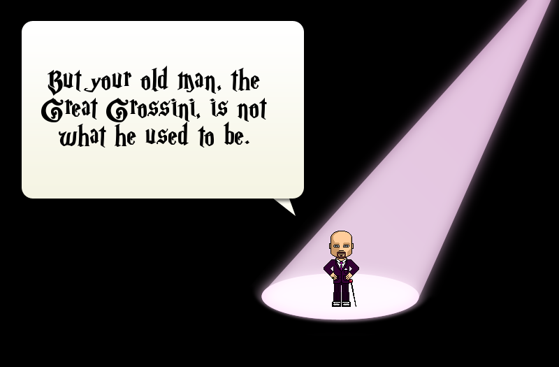
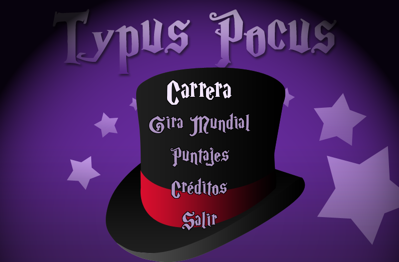
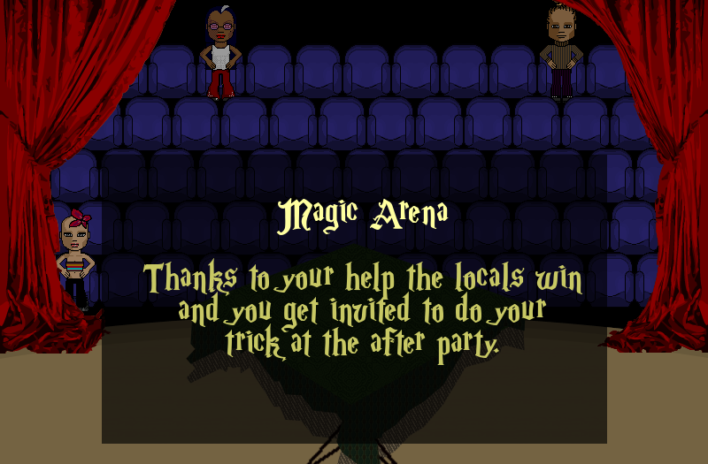

# Typus Pocus

A magician that needs to type spells to go through their particular adventure.

## Origin

Made by the Python Users Group of Argentina. Winner of the team category in [PyWeek](https://pyweek.org/) [3rd edition](https://pyweek.org/3/) .

## Getting Started

### Prerequisites

Python v3 installed.

### How to run from sources

1. Clone the repository: `$ git clone https://github.com/facundobatista/typuspocus`
2. Get into the directory: `$ cd typuspocus`
3. Create a virtual env: `$ python -m venv env`
4. Activate virtual env: `$ source env/bin/activate`
5. Install dependencies:  `(env)$ pip install -r requirements.txt`
6. Run the game: `(env)$ python -m typuspocus`

## Gameplay

You are a magician. There's an object over the table that you have to vanish. In order to do it, you have to type a spell that appears onscreen. You better do it fast and accurately, or else the audience will get bored.

## Screenshots

## License

This project is licensed under the GPLv2 License - see the `gpl-2.txt` file for details.

